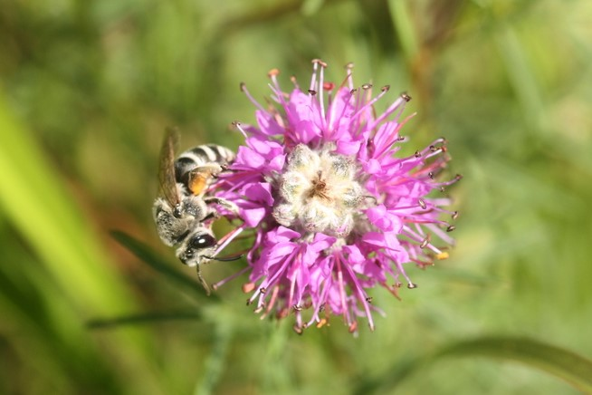

I am a 5th-year Ph.D. candidate at the University of Tennessee studying community ecology, plant-pollinator interactions, and the natural history of native bee and plant communities. My research prioritizes the conservation of the North American native bee fauna, a fascinating group of organisms that has been historically overlooked for their diversity and invaluable role in pollinating both wild and agricultural flowering plants.

Outside of research, I enjoy hiking, reading, and photography. My nature photos can be seen on my [iNaturalist](https://www.inaturalist.org/people/samwilhelm) page.

